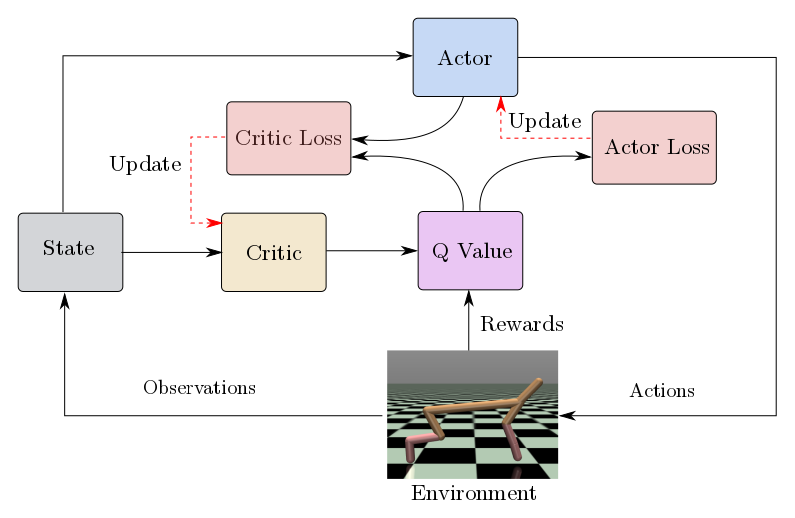
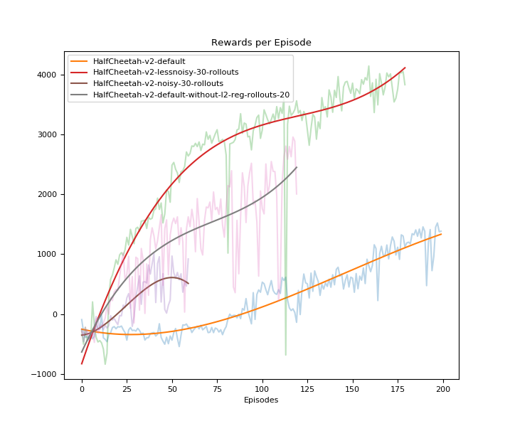

# Reinforcement Learning
## Deep Deterministic Policy Gradients

We present our implementation of an Reinforcement Learning Algorithm called DeepDGP, presented by [Lillicrap et
al.](https://arxiv.org/abs/1509.02971).

For more details, please refer to my [blog post](https://deshpandeshrinath.github.io/blog/2018/05/05/DDPG).

### Trained [MuJoCo environments](https://gym.openai.com/envs/#mujoco)

<a href="https://www.youtube.com/embed/C5tIEuEycJY " target="_blank"></a>

### Usage Instructions
We recommend to use python 3.
Install necessary dependencies like openAI-gym by

``` python
pip3 install gym
pip3 install tensorflow
pip3 install tqdm
pip3 install matplotlib
```

To train and run [MuJoCo environments](https://gym.openai.com/envs/#mujoco),
get a one month-trial license from [MuJoCo](http://www.mujoco.org/).
If you are student with .edu address, you can get 1-year MuJoCo license for
free.


``` python
cd src
python3 train.py --env_id='<any openAI-gym continuous environments>' --model_dir=../trained_models/
```

To run our pretrained models
```
cd src
python3 run.py --env_id=Pendulum-v0 --model_dir=../trained_models/Pendulum-v0/
```

## Introduction

- RL allows machines and software agents to automatically determine the ideal behavior within a specific context, in order to maximize its performance / rewards.
- Simple reward feedback is required for the agent to learn its behavior; this is known as the reinforcement signal.

### Why DDPG?

- Deep Q Network showed a great success in playing Atari games, however it works only for discrete action spaces.

- Discretizing continuous action space with many dimensions suffers from curse of dimensionality.

- DDPG solves this problem by introducing a variant of actor-critic method.



## Algorithm

1. Initialize NN parameters randomly

2. Make a copy of actor and critics and store them as target_actor, target_critic.

3. Actor predicts action based on current state state plus added noise.

4. Receive reward r_t for the action at as well as observations, which results into next state s_{t+1}.

5. Store this tuple into experience buffer as, e = (s_t, a_t, r_t, s_{t+1})

6. Repeat this for N times to generate some experience.

7. Pick a batch of experiences randomly and compute R.H.S. of bellman equation using target networks.

8. Calculate the gradients for critic and actor using the experience batch, Lc and  policy gradient, respectively.

9. Update target_actor and target_critic parameters by following soft update rule,

10. Repeat.


## Hyper-Parameter Tuning
The classical trade-off faced by Reinforcement learning is Exploration vs
Exploitation. This trade-off is adjusted by tuning the hyper-parameters of
algorithm.

The hyper-parameters for DDPG are,

1. Gamma : Discount factor which determines the amount of importance given to future rewards compared to
    present.

2. Number of Roll-out steps : The number of steps after which networks are trained
   for K number of train steps. These are the steps allowed for random
   exploration experience build up.

3. Std Deviation of Action Noise : We use Ornstein-Uhlenbeck process for adding action noise,
   which suits to systems with inertia. By changing the deviation, we change the
   degree of exploration.

4. Number of Train steps : We train the parameters of Actor and Critic for K
   number of steps, after exploration steps.


### Tuning the hyper-parameters for desired behaviors

As an example, we see in Half-Cheetah environment, cheetah gets reward to run in
forward direction. In the training, we find that it first flips itself as a
result of initial random exploration and then behaves in a way to keep moving
forward but in flipper state.

Also, as it flips initially or in between, its running speed gets affected causing
reduction in overall reward.

We tackle this situation, by reducing number of roll-out steps, which are
exploration steps causing it to flip at start. We see the changes in the
algorithm reflected in the behavior of cheetah.
Instead of rushing in forward direction, which would cause the loss of balance,
cheetah learns a stable gait with increased speed and recieves overall maximum reward.



As it can be seen from images, the setting with less noise and less number of
roll-out states with regularization receives the maximum reward and a plausible
gait.

#### This video shows the effect of parameter tuning on the gait of Half Cheetah
<a href="https://www.youtube.com/embed/qU8Nd9lyxlw" target="_blank"></a>

